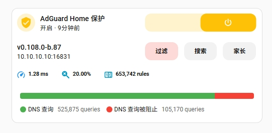
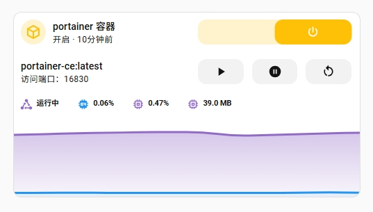

> For English version, see [English](README.en.md)

# Custom Stack Cards

[](https://github.com/PraxiGEN/custom-stack-cards/releases)
[](https://github.com/custom-stack-cards/blob/main/LICENSE)
[](https://github.com/hacs/plugin)

**Custom Stack Cards** 是 Home Assistant 的自定义卡片库，提供 **Vertical**  **Horizontal** **Grid** 三种卡片类型。它允许在单个 `<ha-card>` 内堆叠多个卡片，支持自定义样式，并保留原生 UI 编辑器功能。相比官方堆叠卡片，它去掉了多余的边框与阴影，让界面更简洁。

---




## 特性

- 垂直堆叠：`custom:vertical-stack-in-card`  
- 水平堆叠：`custom:horizontal-stack-in-card`
- 网格堆叠：`custom:grid-stack-in-card`
- 支持 `styles: ` 自定义样式, 支持CSS属性  
- 保留原生 UI 编辑器兼容性  
- 去除默认边框和阴影
- 默认支持 `Sections` 视图 

---

## 安装

### 使用 [HACS](https://hacs.xyz/) (推荐)

 One-click installation from HACS: 

[](https://my.home-assistant.io/redirect/hacs_repository/?owner=PraxiGEN&repository=custom-stack-cards&category=plugin)

**或者手动操作：**

1. 打开 Home Assistant
2. 前往 **HACS**
3. 在搜索框中输入 **"Custom Stack Cards"**
4. 点击 **“下载 (Download)”**

### 手动安装

1. 下载 `custom-stack-cards.js` 文件。
2. 复制到 Home Assistant：

  - 将下载的文件移动到 Home Assistant 的配置目录（`<config>`）下的 `www` 文件夹中：
  ```yaml
  <config>/www/
  ```
  - 如果该文件夹不存在，请先手动创建 www 文件夹。

3. 添加资源引用：

[](https://my.home-assistant.io/redirect/lovelace_resources/)

  - 进入 设置 → 仪表盘
  - 点击右上角的 ⋮（三个点菜单），然后选择 资源。
  - 点击右下角的 + 添加资源 按钮。
  - 在弹窗中输入以下内容：
    - URL: /local/custom-stack-cards.js?v=0.0.1  
    - Resource type: JavaScript Module
  - 点击 创建。

4. 重启 Home Assistant 前端：
  - 刷新浏览器缓存
  - 如果问题仍然存在，请尝试重启 Home Assistant 实例。

---

## 配置参数

| 参数            | 类型     | 默认值 | 说明                                                                  |
| ------------- | ------ | --- | ------------------------------------------------------------------- |
| type          | string | —   | `custom:vertical-stack-in-card` 或 `custom:horizontal-stack-in-card` |
| title         | string | —   | 卡片标题                                                                |
| cards         | array  | —   | 要堆叠的卡片数组                                                            |
| grid\_options | object | —   | 布局选项，支持 columns 和 rows                                             |
| styles        | object | —   | 自定义样式（⚠️ 仅 YAML 配置，不支持可视化编辑器）                             |

---

## 使用示例

### Stack
```yaml
type: custom:vertical-stack-in-card  # 或 custom:horizontal-stack-in-card / custom:grid-stack-in-card
title: My Stack
cards:
  - type: sensor
    entity: sensor.time
  - type: sensor
    entity: sensor.date
```

---

## 注意事项
`styles: `只支持根卡片，子卡片请使用`card_mod`。

## 链接
- 仓库地址：[PraxiGEN/custom-stack-cards](https://github.com/PraxiGEN/custom-stack-cards)
- 原始项目：[ofekashery/vertical-stack-in-card ](https://github.com/ofekashery/vertical-stack-in-card) —— 感谢原作者 [ofekasher](https://github.com/ofekasher) 的开源贡献
